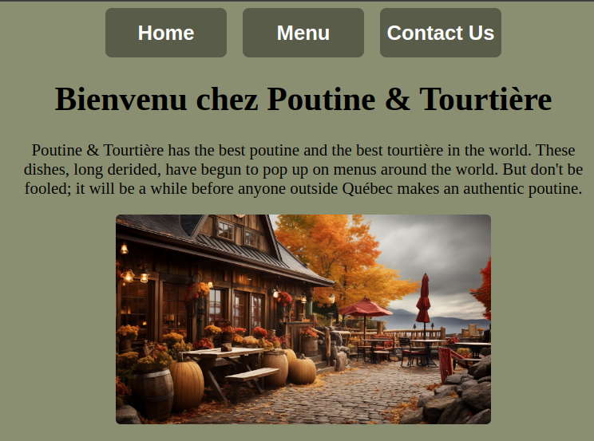

# full-stack-restaurant
A restaurant homepage created dynamically (entirely with JavaScript)

# Preview

    

# Links

-[Assignment Page (Jan '24)](https://www.theodinproject.com/lessons/node-path-javascript-restaurant-page)

-[Finished Project](https://erreurdesyntaxe.github.io/full-stack-restaurant/)

# Built With

-HTML  
-CSS  
-JavaScript  
-webpack  

# Notable Features

-A feature followed by a double space  

# Challenges

-A challenge followed by a double space  

# Diary

Something to say
